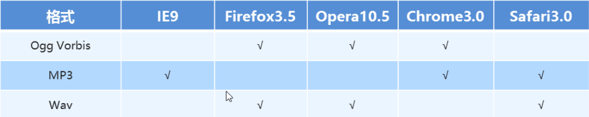
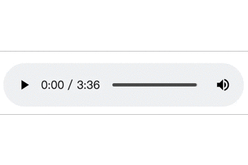
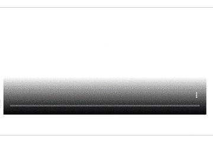

# HTML5新增标签
## 一·新增语义化标签
- header    --头部标签
- nav   --导航标签
- article   --内容标签
- section   --块级标签
- aside --侧边标签栏
- footer    --尾部标签  
**主要是替代之前的`<div class="header/nav/.../footer"></div>`效果**  
*有以下需要注意的:*
1. *主要用于搜索引擎收录*
2. *可以多次使用*
3. *在IE9中需要转为块级元素*
4. *语义化的标签，在移动端比较友好*  
#### 代码示例：
```
<body>
    <header class="pink">
        <h3>header</h3>
    </header>
    <nav class="pink">
        <h3>nav</h3>
    </nav>
    <article class="pink">
        <h3>article</h3>
    </article>
    <section class="pink">
        <h3>section</h3>
    </section>
    <aside class="pink">
        <h3>aside</h3>
    </aside>
    <footer class="pink">
        <h3>footer</h3>
    </footer>
</body>
```
#### 标签效果：

## 二·新增多媒体标签
### 1.音频标签--audio
原来在不使用标签的情况下也可以用音频，新加标签后可以支持更多的音频文件格式（ogg/mp3/wav）  
不同的浏览器对音频文件支持不同，具体如下：

格式|IE9|Firefox3.5|Opera10.5|Chrome3.0|Safari3.0
--|:--:|:--:|:--:|:--:|:--:|
Ogg Vorbis| |支持|支持|支持| |
MP3|支持| | |支持|支持|
Wav| | 支持|支持| |支持|
<!--  -->
#### 标签属性：
属性|值|描述
--|--|--
autoplay|autoplay|音频会自动播放（google浏览器除外）
controls|controls|加上该属性会在面板显示一个控制面板
loop|loop|音频循环播放
src|url|要播放音频的url，为避免兼容问题，一般会加上多种资源

#### 代码示例：
```
<audio controls>
    <source src="media/芒种.mp3">
    <source src="media/芒种.ogg">
您的浏览器不支持audio标签
</audio>
```
#### 标签效果：

### 2·视频标签--video
以前都是flash来实现视频播放，但是flash本身存在漏洞  
不同浏览器对标签的兼容性：  

格式|IE|Firefox|Opera|Chrome|Safari
--|--|--|--|--|--
Ogg|No|3.5+|10.5+|5.0+|No
MPEG4|9.0+|No|No|5.0+|3.0+
WebM|No|4.0+|10.6+|6.0+|No
#### 标签属性
属性|值|描述
--|--|--
autoplay|autoplay|视频就绪就自动播放（谷歌浏览器需要添加muted静音来实现自动播放）
controls|controls|显示视频播放控件
width|px|设置播放器宽度
height|px|设置播放器高度
loop|loop|循环播放
preload|auto/none|是否预先加载视频
src|url|视频文件地址
poster|imgurl|视频加载画面显示的图片
muted|muted|静音播放
#### 代码示例
```
    <video controls preload="none" loop muted poster="img/video_1.jpg" width="500px">
        <source src="media/tvc.mp4"> 
    </video>
```
#### 标签效果



