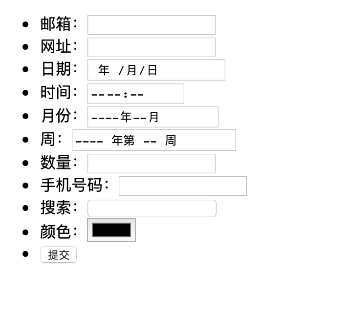
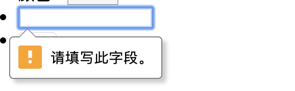
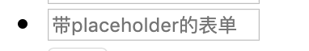
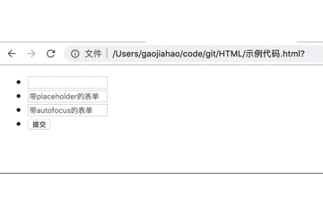
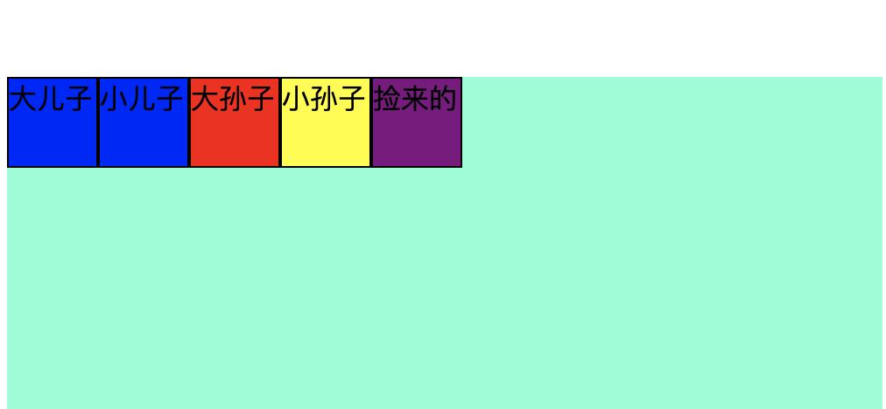
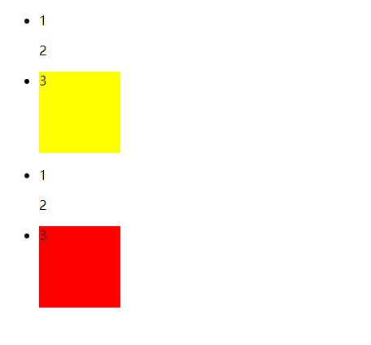

# HTML5新增内容
## 一·新增语义化标签
- header    --头部标签
- nav   --导航标签
- article   --内容标签
- section   --块级标签
- aside --侧边标签栏
- footer    --尾部标签  
**主要是替代之前的`<div class="header/nav/.../footer"></div>`效果**  
*有以下需要注意的:*
1. *主要用于搜索引擎收录*
2. *可以多次使用*
3. *在IE9中需要转为块级元素*
4. *语义化的标签，在移动端比较友好*  
##### 代码示例：
```
<body>
    <header class="pink">
        <h3>header</h3>
    </header>
    <nav class="pink">
        <h3>nav</h3>
    </nav>
    <article class="pink">
        <h3>article</h3>
    </article>
    <section class="pink">
        <h3>section</h3>
    </section>
    <aside class="pink">
        <h3>aside</h3>
    </aside>
    <footer class="pink">
        <h3>footer</h3>
    </footer>
</body>
```
##### 标签效果：

## 二·新增多媒体标签
### 1.音频标签--audio
原来在不使用标签的情况下也可以用音频，新加标签后可以支持更多的音频文件格式（ogg/mp3/wav）  
不同的浏览器对音频文件支持不同，具体如下：

格式|IE9|Firefox3.5|Opera10.5|Chrome3.0|Safari3.0
--|:--:|:--:|:--:|:--:|:--:|
Ogg Vorbis| |支持|支持|支持| |
MP3|支持| | |支持|支持|
Wav| | 支持|支持| |支持|
<!--  -->
##### 标签属性：
属性|值|描述
--|--|--
autoplay|autoplay|音频会自动播放（google浏览器除外）
controls|controls|加上该属性会在面板显示一个控制面板
loop|loop|音频循环播放
src|url|要播放音频的url，为避免兼容问题，一般会加上多种资源

##### 代码示例：
```
<audio controls>
    <source src="media/芒种.mp3">
    <source src="media/芒种.ogg">
您的浏览器不支持audio标签
</audio>
```
##### 标签效果：

### 2·视频标签--video
以前都是flash来实现视频播放，但是flash本身存在漏洞  
不同浏览器对标签的兼容性：  

格式|IE|Firefox|Opera|Chrome|Safari
--|--|--|--|--|--
Ogg|No|3.5+|10.5+|5.0+|No
MPEG4|9.0+|No|No|5.0+|3.0+
WebM|No|4.0+|10.6+|6.0+|No
##### 标签属性
属性|值|描述
--|--|--
autoplay|autoplay|视频就绪就自动播放（谷歌浏览器需要添加muted静音来实现自动播放）（重点）
controls|controls|显示视频播放控件
width|px|设置播放器宽度
height|px|设置播放器高度
loop|loop|循环播放
preload|auto/none|是否预先加载视频
src|url|视频文件地址
poster|imgurl|视频加载画面显示的图片
muted|muted|静音播放
##### 代码示例
```
    <video controls preload="none" loop muted poster="img/video_1.jpg" width="500px">
        <source src="media/tvc.mp4"> 
    </video>
```
##### 标签效果

## 三·新增input属性

属性值|说明
--|--
type="email"|限制用户输入必须为邮箱地址
type="url"|限制用户输入必须为URL类型
type="date"|限制用户输入必须为日期类型
type="time"|限制用户输入必须为时间
type="month"|限制用户输入必须为月类型
type="week"|限制用户输入必须为周类型
***type="number"***|限制用户输入必须为数字类型
***type="tel"***|限制用户输入必须为手机号格式
***type="search"***|搜索框
type="color"|颜色选择表单

##### 代码示例
```
    <form action="">
        <ul>
            <li>邮箱：<input type="email"/></li>
            <li>网址：<input type="url"/></li>
            <li>日期：<input type="date"/></li>
            <li>时间：<input type="time"/></li>
            <li>月份：<input type="month"/></li>
            <li>周：<input type="week"/></li>
            <li>数量：<input type="number"/></li>
            <li>手机号码：<input type="tel"/></li>
            <li>搜索：<input type="search"/></li>
            <li>颜色：<input type="color"/></li>

            <li> <input type="submit" value="提交"></li>
        </ul>
    </form>
```
##### 标签效果

## 四·新增表单属性
### 1、required
设置表单内容变为必填，值为"required"
##### 代码示例：
```
<li><input type="text" required="required"></li>
```
##### 代码效果：

### 2、placeholder
设置表单内默认显示的文字，输入内容会消失，值是要显示的内容；
##### 代码示例：
```
<li><input type="text" placeholder="带placeholder的表单"></li>
```
##### 代码效果：

### 3、autofocus
设置网页打开时自动聚焦到该表单，值设置autofocus
##### 代码示例：
```
<li><input type="text" autofocus="autofocus" placeholder="带autofocus的表单"></li>
```
#### 代码效果：

### 4、autocomplete
设置记录历史填入信息，可以自动完成历史信息输入，值设置"on"/"off";
##### 代码示例：
```

```
##### 代码效果：

# CSS3新增内容
## 一、新增选择器
### 1、属性选择器
选择器|匹配结果
--|--
a[b]|匹配具有b属性的a标签
a[b="c"]|匹配具有b属性且属性值是c的a标签
a[b^="c"]|匹配具有b属性并且属性值以c开头的a标签
a[b$="c"]|匹配具有b属性并且属性值以c结尾的a标签
a[b*="c"]|匹配具有b属性并且属性值包含c的a标签

> 注意事项：  
>用中括号来表示属性;  
>标签和中括号之间不用保留空格；
>类选择器、属性选择器、伪类选择器权重都是10；
##### 代码示例：
```
<div class="father">
    <span class="son1">大儿子</span>
    <span class="son2">小儿子</span>
    <span class="grandson1">大孙子</span>
    <span class="grandson2">小孙子</span>
    <span>捡来的</span>
</div>

<style>
    .father {
        width: 500px;
        height: 500px;
        background-color: aquamarine;
    }
    span{
        float:left;
        width: 50px;
        height: 50px;
        background-color:pink;
        border: black 1px solid;     
    }
    span[class]{
        background-color:blue;
    }
    .father span[class^="grand"]{
        background-color: yellow;
    }
    .father span[class$="dson1"]{
        background-color: red;
    }
    .father span[class*="i"]{
        background-color: purple;
    }
</style>
```
##### 代码效果：

### 2、结构伪类选择器
选择器|匹配结果
--|--
A:first-child|匹配父级元素中的第一个子元素,相当于a:nth-child(1)；
A:last-child|匹配父级元素中的最后一个元素,a：nth-last-child(1)；
A:nth-chile(n)|匹配父级元素中的第n个a元素，n可以是**整数**、**关键词**（even/odd）,也可以是**公式**;n从1开始(常见公式：2n,2n+1,5n,5-n,5+n)；
A:nth-last-child|匹配父级元素中倒数第n个元素；
A:first-of-type|选择父元素中第一个类型为A的子元素；
A：last-of-type|选择父元素中最后一个类型为A的子元素
A:nth-of-type(n)|选择父元素中第n个类型为A的子元素
>**A:nth-child和A:nth-of-type的区别**  
nth-child会从所有子元素中选取，如果最后选中的不是A类型会导致未选中任何元素，nth-of-type是先把A类元素选出来，再挑第n个。
##### 代码示例：
```
    <ul class="child">
        <li>1</li>
        <p>2</p>
        <li>3</li>
    </ul>
    <ul class="type">
        <li>1</li>
        <p>2</p>
        <li>3</li>
    </ul>

     .child li:nth-child(2) {
            width: 100px;
            height: 100px;
            background-color: blue;
        }
        
        .child li:nth-child(3) {
            width: 100px;
            height: 100px;
            background-color: yellow;
        }
        
        .type li:nth-of-type(2) {
            width: 100px;
            height: 100px;
            background-color: red;
        }

```
##### 代码效果：

### 3、伪元素选择器
选择器|作用
--|--
A::before|在A元素内容的前面加入一个行内元素
A::after|在A元素内容的后面加入一个行内元素
>**注意事项**  
选择器内必须包含content属性；  
伪元素选择器和标签选择器一样，权重是1；  
加入的内容是行内元素；
##### 代码示例
```

```
##### 代码效果

## 二、转换
### 1、2D转换
#### （1）位移
#### （2）旋转
#### （3）缩放
#### （4）综合写法
### 2、3D转换
#### （1）三维坐标系
#### （2）3D移动
#### （3）3D旋转
#### （4）透视
#### （5）3D呈现
## 三、动画
### 1、基本属性
### 2、动画序列
### 3、动画属性
##### 常用属性：
动画属性|作用|属性参数
--|--|--
@keyframes|规定动画|命名规则
animation-name|动画名称|已设置的动画名称
animation-duration|动画完成一个周期的时间|s/ms
animation-timing-function|速度曲线|ease/linear/steps( )
animation-delay|动画开始时间|s/ms
animation-iteration-count|动画循环次数|正整数/infinite
animation-direction|动画在下一周期播放的方向|normal/alternate
animation-fill-mode|动画结束时的状态|保持forwards/回到起始backwards
animation-play-state|动画播放状态|running/paused

##### 属性简写：
animation: 动画名称 持续时间 运动曲线 何时开始 播放次数 是否反方向 动画起始或结束的状态;  
animation: name duration timing-function delay iteration-count direction fill-mode;  
前两个属性不能省略。  
简写不包含暂停播放的状态，状态经常和鼠标操作搭配使用。
##### 速度曲线详解
值|描述
--|--
linear|匀速
ease|默认，低速开始变快，结束变慢
ease-in|以低速开始
ease-out|以低速结束
ease-in-out|以低速开始和结束
steps( )|指定时间函数中的步长 (突变式，上面其他的是渐变式))
## 四、浏览器私有前缀


