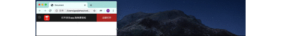
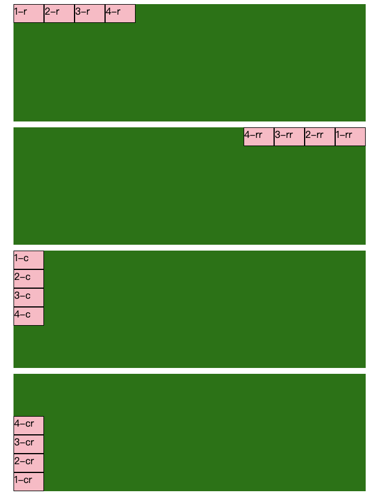
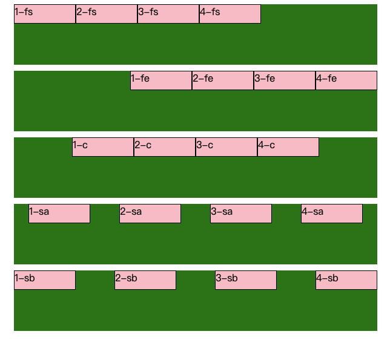
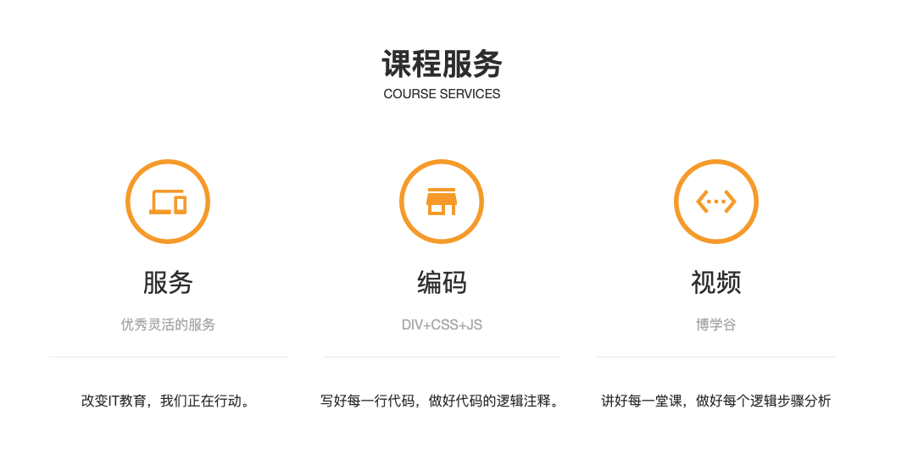

# 一、移动端基础
## 1、概况
* 目前主流的移动端浏览器，大都是webkit内核，对新技术有较好的兼容性。
* 移动端开发主要针对手机端进行开发
* 移动端碎片化比较严重，分辨率和屏幕尺寸大小不一。
* 用谷歌浏览器的模拟手机界面进行调试
## 2、视口
### 概念：
> 视口就是浏览器显示页面内容的屏幕区域,视口可以分为**布局视口**、**视觉视口**和**理想视口**;  
> 布局视口：设备默认设置的视口，一般为980px；  
> 视觉视口：就是在设备上看到的区域；  
> 理想视口：将布局视口设置的和默认视觉视口相同；  
### 理想视口meta标签
```
<meta name="viewport"  content="width=device-width,initial-scale=1.0,maximum-scale=1.0,minimum-scale=1.0,user-scalable=no">
```
## 3、多倍图
### 物理像素和物理像素比
> 物理像素就是物理显示的最小颗粒，也就是平时说的分辨率；  
> CSS像素就是开发时设置的像素，CSS像素*物理像素比=物理像素
### 多倍图
> 为了应付在移动端图片被放大后出现模糊的现象，在准备图片时就准备多倍css像素的图片，将图片长宽限制到指定大小；  
> 平时开发中的多倍图多为二倍图和三倍图
### background-size标签
图片使用指定长宽限制，背景图片使用background-size标签进行限制 

标签|作用|参数
--|--|--
background-size|设置背景图片大小|px,百分比,cover,contain
> cover:等比例拉伸，完全覆盖盒子，可能有部分背景图片显示不全；  
> contain：等比例拉伸，当宽度或者高度完全覆盖时就不再拉伸，可能有部分空白区域；

### 多倍图切图
利用切图工具选择ios可以方便的切出2倍和3倍图

## 4、移动端技术解决方案
### 开发选择
开发方案|特点
--|--
单独制作移动端界面（主流）|通过判断不同的设备打开不同的页面
响应式兼容界面|通过改变宽度和布局响应不同的设备
### 移动端特有样式
>兼容性只需要考虑webkit  
>初始化使用normailize.css文件
#### (1)新的盒子模型
标签|说明|特点
--|--|--
box-sizing:box|传统盒子|边框、内边距会算入盒子宽度
box-sizing:border-box|新盒子|不再撑开盒子
#### (2)去除点击链接时的高亮效果
```
-webkit-tap-highlight-color:transparent;
```
#### (3)禁用长按页面时弹出的菜单
```
-webkit-touch-callout:none;
```
## 5、移动端常见布局
* 流式布局（百分比布局）
* Flex弹性布局
* Rem布局
* 响应式布局（bootstrap框架）

# 二、流式布局
## 1、概念
>流式布局就是百分比布局，也称为非固定布局.  
>就是将盒子的长宽设置为父级盒子的百分比来根据屏幕的宽度进行伸缩，不受
>固定像素的限制，内容向两侧填充;

**注意点:**  
为了避免无限伸缩可以设置:
```
max-wigth: 最大宽度;
min-width: 最小宽度;
```
## 2、实例：JD移动端首页
1. 前提操作
   1. 搭建目录结构
        * /img
        * /upload
        * /css
        * index.html
    2. 设置视口标签、引入初始样式；
2. 首页制作
   1. body设置
        * 限制宽度
        * 对齐
        * 字体
   2. app设置
        * 通过百分比设置好小盒子
        * 设置小盒子样式
        * 图片上下居中（vertical-align:midle）
   3. 搜索模块
        >**二倍精灵图**  
        >1.将精灵图等比例设置为之前的一半;  
        >2.重新测量坐标;  
        >3.背景图位置设置新坐标，同时要将背景图大小设置为一半;
   1. 导航栏
      > div内包含10个a标签，每行5个a标签，a宽度就设置20%;  
      >a内部设置一个img和一个span来装图片和文字;  
      >左右对齐统一用text-align:center

##### 代码示例
```
.app ul li:nth-child(1) {
    width: 8%;
}
.app ul li:nth-child(2) {
    width: 10%;
}
.app ul li:nth-child(3) {
    width: 57%;
}
.app ul li:nth-child(4) {
    width: 25%;
    background-color: #b83228;
}
```
##### 代码效果

 
# 三、Flex弹性布局
## 1、布局原理
* 定义
     >flex是flexable box的缩写，意思是弹性布局，用来为盒状模型提供最大的灵活
     >度，任何一个容器都可以指定为flex布局.
* 注意点
     >当我们为父盒子设置为flex布局之后，子元素的float、clear和vertical-align
     >属性将失效。  
     >伸缩布局=弹性布局=伸缩盒布局=弹性盒布局=flex布局
* 使用
     >通过给父盒子添加flex属性，来达到控制子盒子的位置和排列方式。

## 2、常用属性
### 父项属性
#### (1)flex-direction  设置主轴方向
参数|作用
--|--
row|从左到右（默认）
row-reverse|从右向左
column|从上到下
column|从下到上
#### 示例代码：
```
.green {
   display: flex;
   width: 600px;
   height: 200px;
   margin: 10px;
   background-color: green;
}
.flex-d-r{
    flex-direction: row;
}
.flex-d-rr{
    flex-direction: row-reverse;
}
.flex-d-c{
    flex-direction: column;
}
.flex-d-cr{
    flex-direction: column-reverse;
}
.pink{
   width: 50px;
   height: 30px;
   background-color: pink;
   border: black 1px solid;
}

<div class="green flex-d-r">
    <div class="pink">1-r</div>
    <div class="pink">2-r</div>
    <div class="pink">3-r</div>
    <div class="pink">4-r</div>
</div>
<div class="green flex-d-rr">
    <div class="pink">1-rr</div>
    <div class="pink">2-rr</div>
    <div class="pink">3-rr</div>
    <div class="pink">4-rr</div>
</div>
<div class="green flex-d-c">
    <div class="pink">1-c</div>
    <div class="pink">2-c</div>
    <div class="pink">3-c</div>
    <div class="pink">4-c</div>
</div>
<div class="green flex-d-cr">
    <div class="pink">1-cr</div>
    <div class="pink">2-cr</div>
    <div class="pink">3-cr</div>
    <div class="pink">4-cr</div>
</div>
```
#### 代码效果：


#### (2)justify-content  设置主轴上元素的排列方式
参数|作用
--|--
flex-start|贴着起始边
flex-end|贴着结束边
center|居中对齐
space-around|平分剩余空间
space-between|左右先贴边再平分
#### 示例代码：
```
.justify-content-fs{
    justify-content: flex-start;
}
.justify-content-fe{
    justify-content: flex-end;
}
.justify-content-c{
    justify-content: center;
}
.justify-content-sa{
    justify-content: space-around;
}
.justify-content-sb{
    justify-content: space-between;
}

<div class="green justify-content-fs">
    <div class="pink">1-fs</div>
    <div class="pink">2-fs</div>
    <div class="pink">3-fs</div>
    <div class="pink">4-fs</div>
</div>
<div class="green justify-content-fe">
    <div class="pink">1-fe</div>
    <div class="pink">2-fe</div>
    <div class="pink">3-fe</div>
    <div class="pink">4-fe</div>
</div>
<div class="green justify-content-c">
    <div class="pink">1-c</div>
    <div class="pink">2-c</div>
    <div class="pink">3-c</div>
    <div class="pink">4-c</div>
</div>
<div class="green justify-content-sa">
    <div class="pink">1-sa</div>
    <div class="pink">2-sa</div>
    <div class="pink">3-sa</div>
    <div class="pink">4-sa</div>
</div>
<div class="green justify-content-sb">
    <div class="pink">1-sb</div>
    <div class="pink">2-sb</div>
    <div class="pink">3-sb</div>
    <div class="pink">4-sb</div>
</div>
```
#### 代码效果：

#### (3)flex-wrap   设置子元素是否换行
参数|作用
--|--
nowrap|不换行（默认）
wrap|换行
>不换行时，如果盒子超过父盒子宽度会将子盒子进行压缩。
#### (4)align-items 设置侧轴的排列方式（单行）
参数|作用
--|--
flex-start|贴着起始边
flex-end|贴着结束边
center|居中对齐
strech|沿着侧轴方向进行拉伸(子元素不能设置高度)
#### (5)align-content 设置侧轴的排列方式（多行）
参数|作用
--|--
flex-start|贴着起始边
flex-end|贴着结束边
center|居中对齐
space-around|平分剩余空间
space-between|左右先贴边再平分
stretch|沿着侧轴方向进行拉伸(子元素不能设置高度)
#### (6)flex-flow   相当于是flex-direction和flex-wrap的简写
#### 元素对齐总结
标签|作用|flex-start|flex-end|center|space-around|space-between|stretch
--|--|:--:|:--:|:--:|:--:|:--:|:--:
justify-content|主轴上元素排列|✅|✅|✅|✅|✅|
align-items|侧轴上单行元素排列|✅|✅|✅|||✅|
align-content|侧轴上多行元素排列|✅|✅|✅|✅|✅|✅|
### 子项属性
标签|作用
--|--
flex|设置子元素分配的剩余空间，用flex表示占多少份；
align-self|控制子项自己在侧轴的排列方式；
order|设置子元素的排序，默认是0，数越小越靠前；
## 渐变色背景
```
background:-webkit-linear-gradient(起始位置,起始颜色,终止颜色);
background:-webkit-linear-gradient(left,red,blue);
```
>**注意点：**  
>pc端使用必须加前缀；  
>默认的起始位置是上；
# 四、Rem布局
## rem单位
### 1、简介
>**em**  
>相对于父级元素的字体大小来定义的，存在局限性；  
>**rem**  
>(root em)相对于html标签的文字大小来定义的；  
>优点：通过修改html里面的文字大小可以达到修改页面所有元素的效果。
### 2、适配方案
* less+媒体查询+rem
* flexable.js+rem
### 3、实际操作
1. 选择设计稿尺寸，一般是750px；
2. 动态设置html的font-size值，划分屏幕尺寸；
3. 元素大小取值公式： rem=元素自身尺寸/html的font-size

## 媒体查询

### 1、作用
>通过媒体查询可以实现在不同的页面大小下实现不同的效果。
### 2、语法
```
@media mediatype and|not|only (media feature) {css-code;}
```
>**meidatype 媒体类型：**  
>*all*    用于所有设备  
>*print*  用于打印机和打印预览  
>*screen* 用于电脑屏幕、手机屏幕、智能手机等
  

>**关键字:**  
>*not* 排除某个条件  
>*and* 并列某个条件  
#### 示例代码：
```
@media screen and (max-width: 767px){
    .head{
        width: 100%;
    }
}
```
>**媒体特性**：  
>最小，最大
### 注意点：
1. 媒体查询一般按照从小到大或者从大到小来规定范围，利用代码的层叠性，按照从小到大的顺序可以省略 max-width 属性
2. screen 和条件之间一定要记得写 and 关键字
## less语法
### 1、维护 css 的弊端
css 是一门非程序式语言，没有变量、函数、作用域等概念，存在下列的弊端
* 需要书写大量看似没有逻辑的代码，冗余度较高
* 不利于维护及扩展，不利于复用
* 没有很好的计算能力
*非前端开发工程师，往往因为缺少CSS编写经验而很难写出组织良好且易于维护的CSS代码项目

### 2、less 介绍和安装使用
Less 是一门CSS的扩展语言，它扩展了CSS的动态属性。

#### 安装：
1. 先安装 nodejs 
2. 检查 node 是否安装 node -v
3. 再安装 less 
4. 检查安装  lessc -v
>mac 安装less命令：sudo npm install less -g
检查安装  lessc -v

#### 使用：
通过在 vscode 中安装 easyless 插件，保存 less 文件后会自动生成 css 文件

### 3、less变量
#### 语法：  
 @变量名：值；

#### 变量名规则：
* 必须有@为前缀
* 不能包含特殊字符
* 不能以数字开头
* 大小写敏感
#### 示例代码：
```
@deeppink: pink;
@font14:14px;
{background-color: @deeppink;
font: font14;
}
```

### 4、less 嵌套
less 语法支持嵌套
父级元素内可以直接写子元素的样式
> 注意点：伪类、伪元素、交集 要使用&，没有符号会被认为是后代元素.
```
示例代码：
.nav{
	&:hover{
	}
}
```
### 5、less运算

* 加+ 减 - 乘 * 除 /   
* 还支持小括号，优先运算  
* 运算符的左右两侧必须加空格
>**结果单位：**   
>两个参数运算，只有一个有单位，结果就用这个单位; 
>两个参数，带有不同的单位，以第一个参数单位作为结果。

# 五、响应式布局
## 响应式开发原理
不同设备显示不同的布局，依靠媒体查询设置不同布局。
>在实际应用中，依靠媒体查询和操作父级容器来完成。
## 一般响应尺寸划分
尺寸类型|尺寸范围|容器设置
--|--|--
手机/超小屏幕|小于768px|宽度为100%
平板/小屏幕|大于等于768px|宽度为750px
桌面显示器/中等屏幕|大于992px|宽度为970px
大屏幕|大于等于1200px|宽度为1170px
## Bootstrap框架
### 1、框架简介
一套快速开发的响应式布局框架
#### 优点：
* 标准化的html+css编码规范；
* 提供一套简洁、直观、、强悍的组件；
* 有自己的生态圈，不断的更新迭代；
* 让开发更简单，提高开发的效率。
#### 版本号：
* 2.xx版本已经停止维护，兼容性好，代码不够简洁，功能不够完善；
* 3.xx版本目前使用最多，稳定，放弃对ie6/7的支持，对ie8支持，但是效果不好，偏向于开发响应式布局、移动设备优先的布局；
* 4.xx版本，最新版本，尚未流行。
### 2、使用步骤
1. 创建文件夹结构；
2. 创建html骨架结构；
3. 引入相关的样式文件；
4. 书写网页内容。
### 3、布局容器
#### container类
>响应式布局容器，固定宽度

屏幕类型|栅格代码|屏幕尺寸|容器宽度
--|--|--|--
大屏|.col-lg-|大于等于1200px|宽度定为1170
中屏|.col-md-|大于等于992px|宽度为970
小屏|.col-sm-|大于等于768px|宽度为750
超小屏|.col-xs-|小于768px|100%

#### container-fluid类
>流式布局容器，百分百宽度
* 占据全部视口的容器
* 适合于单独做移动端开发
### 4、栅格系统
>将容器(页面内容）平均分为12份，根据不同类名来使用不同的效果，通过设置行和列来布置页面布局.  
>类前缀后面加数字代表占的份数.
#### 注意点：
1. 行必须放到container布局容器内;
2. 要实现列的划分需要加上相应的类前缀;
3. 总和大于12份会进行换行，小于12份，会在右侧留有空白;
4. 每一列默认都有15px的内边距;
5. 可以指定多个类名，以适应不同尺寸的布局;
### 5、列嵌套
>可以将任意元素当作容器来潜入栅格系统。

#### 注意点：
* 直接添加会列元素会导致子级元素存在外边距，先加一个row元素就可以取消该效果。
#### 示例代码：
```
    <div class="container services">
        <div class="row">
            <div class="col-sm-4">
                <div class="serve">
                    
                    <a href="#">服务</a>
                    <p>优秀灵活的服务</p>
                    <div class="fenge"></div>
                    <p>改变IT教育，我们正在行动。</p>
                </div>
            </div>
        </div>
    </div>
```
#### 代码效果

### 6、栅格偏移
>使用类 col-屏幕类型-offset-偏移数量 来完成向右偏移。
#### 示例代码：
```

<div class="logo col-sm-2 hidden-xs">
    <a href="#">
        
    </a>
</div>
<div class="nav col-sm-5 col-sm-offset-5">
    <ul>
        <li>
            <a href="#">首页</a>
        </li>
        <li>
            <a href="#">课程</a>
        </li>
        <li>
            <a href="#">新闻动态</a>
        </li>
        <li>
            <a href="#">关于我们</a>
        </li>
        <li>
            <a href="#">加入我们</a>
        </li>
    </ul>
</div>
```
#### 代码效果

### 7、列排序
>通过.col-屏幕类型-pull和.col-屏幕类型-push来完成排序。
### 8、响应工具
>visible hidden 来设置不同容器显示隐藏的属性

类名|作用
--|--
.hidden-屏幕类型|在指定的屏幕类型内隐藏，其他屏幕尺寸显示
.visible-屏幕类型|在指定的屏幕类型内显示，其他屏幕尺寸隐藏
#### 示例代码：
```
<div class="logo col-sm-2 hidden-xs">
    <a href="#">
        
    </a>
</div>
```
#### 代码效果


